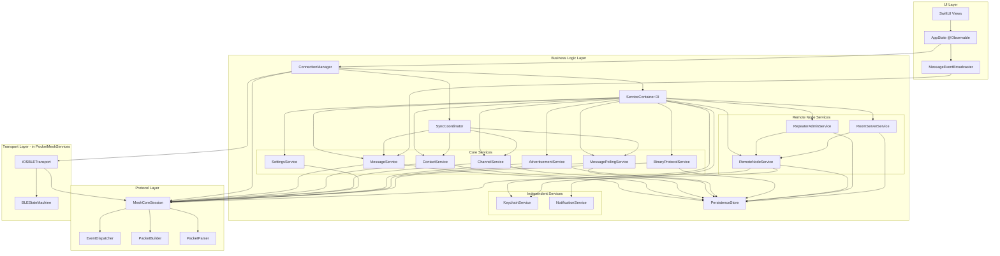

# PocketMesh Architecture

PocketMesh is built using a modern, three-tier modular architecture designed for high performance, reliability, and maintainability. It leverages Swift 6's strict concurrency model, actor isolation, and modern iOS frameworks.

## Platform Requirements

- **Minimum Deployment:** iOS 18.0
- **Feature Target:** iOS 26.0 (uses `#available` checks for newer APIs)
- **Swift:** 6.2+
- **Xcode:** 26.0+

## High-Level Architecture

The project is divided into three main layers:

1. **MeshCore (Protocol Layer)**: A pure Swift implementation of the MeshCore mesh networking protocol.
2. **PocketMeshServices (Business Logic Layer)**: Manages higher-level business logic, actor isolation, and shared persistence.
3. **PocketMesh (UI Layer)**: The SwiftUI-based user interface and application state management.



---

## 1. MeshCore (Protocol Layer)

The foundation of the project, responsible for low-level communication with MeshCore devices.

- **Actor-Based**: `MeshCoreSession` is an actor that serializes all device communication, ensuring thread safety.
- **Event-Driven**: Uses an `EventDispatcher` to broadcast `MeshEvent`s via `AsyncStream`.
- **Stateless Protocol Handlers**: `PacketBuilder` and `PacketParser` are stateless enums that handle the binary encoding/decoding of the Companion Radio Protocol.
- **Transport Abstraction**: The `MeshTransport` protocol allows for different underlying transports. `MockTransport` (for unit testing) is in MeshCore, while `iOSBLETransport` (using CoreBluetooth with `BLEStateMachine`) is in PocketMeshServices.
- **LPP Telemetry**: Includes a full implementation of the Cayenne Low Power Payload (LPP) for efficient sensor data transmission.

See: [MeshCore API Reference](api/MeshCore.md) | [BLE Transport Guide](guides/BLE_Transport.md)

---

## 2. PocketMeshServices (Business Logic Layer)

Bridges the protocol layer and the UI, handling complex business rules and data persistence.

- **Service-Oriented**: Business logic is divided into specialized actors (`MessageService`, `ContactService`, `ChannelService`, `RemoteNodeService`, etc.).
- **Dependency Injection**: `ServiceContainer` manages the creation and wiring of all services, providing a single point of initialization for the service layer.
- **Sync Coordination**: `SyncCoordinator` orchestrates the connection lifecycle and data synchronization through contacts, channels, and messages phases.
- **Actor Isolation**: Every service is an actor, protecting internal state and coordinating asynchronous operations safely.
- **Persistence**: Uses **SwiftData** for local storage. Data is isolated per device using the `deviceID: UUID` field (the device's BLE peripheral UUID) as a namespace, ensuring each device has its own isolated data.
- **DTO Pattern**: Sendable Data Transfer Objects (`MessageDTO`, `ContactDTO`, `DeviceDTO`, etc.) enable safe cross-actor data transfer while maintaining strict concurrency compliance.
- **Connection Management**: `ConnectionManager` (a `@MainActor` observable class) manages the lifecycle of the connection, including pairing via **AccessorySetupKit**, auto-reconnection, and service wiring.
- **Message Polling**: `MessagePollingService` pulls messages from the device queue and routes them to appropriate handlers.

### ServiceContainer & Dependency Injection

The `ServiceContainer` is the central dependency injection container for PocketMeshServices. It creates and manages all services, handling the dependency graph and lifecycle:

**Independent Services** (no service dependencies):
- `KeychainService`: Secure credential storage using the system keychain
- `NotificationService`: Local notification management for message alerts

**Core Services** (depend on session/dataStore):
- `ContactService`: Contact management and synchronization
- `MessageService`: Message sending, receiving, and retry logic
- `ChannelService`: Channel (group) configuration and messaging
- `SettingsService`: Device settings and configuration management
- `AdvertisementService`: Advertisement broadcasting and path discovery
- `MessagePollingService`: Automatic message fetching from device queue
- `BinaryProtocolService`: Binary protocol operations (telemetry, status, etc.)

**Remote Node Services** (depend on other services):
- `RemoteNodeService`: Remote node session management and authentication
- `RepeaterAdminService`: Repeater administration and configuration
- `RoomServerService`: Room server operations and message routing

**Lifecycle Management**:
```swift
// Create container
let container = ServiceContainer(session: meshCoreSession, modelContainer: modelContainer)

// Wire inter-service dependencies
await container.wireServices()

// Start event monitoring when device connects
await container.startEventMonitoring(deviceID: deviceUUID)

// Perform initial sync
await container.performInitialSync(deviceID: deviceUUID)
```

### DTO (Data Transfer Object) Pattern

To comply with Swift 6's strict concurrency model, all SwiftData models have corresponding `Sendable` DTO types for cross-actor communication:

**Model-to-DTO Conversion**:
- `MessageDTO`: Sendable snapshot of `Message` for passing between actors
- `ContactDTO`: Sendable snapshot of `Contact` for UI and service communication
- `DeviceDTO`: Sendable snapshot of `Device` for device information
- `ChannelDTO`: Sendable snapshot of `Channel` for channel configuration
- `RemoteNodeSessionDTO`: Sendable snapshot of `RemoteNodeSession` for session state
- `RoomMessageDTO`: Sendable snapshot of `RoomMessage` for room communications

**Usage Pattern**:
```swift
// In actor-isolated service
func fetchMessages(deviceID: UUID) async -> [MessageDTO] {
    let messages = await dataStore.fetchMessages(deviceID: deviceID)
    return messages.map { MessageDTO(from: $0) }
}

// In @MainActor UI code
let messageDTOs = await messageService.fetchMessages(deviceID: deviceID)
// DTOs are Sendable, safe to use across actor boundaries
```

**Benefits**:
- **Concurrency Safety**: DTOs are `Sendable`, enabling safe cross-actor transfers
- **Immutability**: Snapshot semantics prevent unintended mutations
- **Actor Isolation**: Services work with SwiftData models; UI and callbacks receive DTOs
- **Clean Boundaries**: Clear separation between persistence and business logic layers

See: [PocketMeshServices API Reference](api/PocketMeshServices.md) | [Sync Guide](guides/Sync.md) | [Messaging Guide](guides/Messaging.md)

---

## 3. PocketMesh (UI Layer)

A modern SwiftUI application that provides a user-friendly experience for mesh messaging.

- **AppState**: A central `@Observable` class that manages app-wide state, navigation, and coordination between the UI and services.
- **MessageEventBroadcaster**: Bridges service layer callbacks to SwiftUI's `@MainActor` context for real-time UI updates.
- **SwiftUI & Modern APIs**: Built with the latest SwiftUI features, utilizing `@Observable`, environment injection, and modern navigation.
- **Onboarding Flow**: A guided experience for permissions, discovery, and device pairing.
- **iMessage-Style Chat**: Rich messaging interface with delivery status, timestamps, and metadata (SNR, path length).
- **MapKit Integration**: Displays contact locations on a map with real-time updates and type-based markers.

See: [PocketMesh API Reference](api/PocketMesh.md) | [User Guide](User_Guide.md)

---

## Concurrency & Data Flow

### Concurrency Model

PocketMesh strictly adheres to the **Swift 6 concurrency model**:

- **Actors**: Used for all services and session management to prevent data races.
- **MainActor**: UI updates, `ConnectionManager`, and `MessageEventBroadcaster` are isolated to the main thread.
- **AsyncStream**: Used for all event-driven communication (BLE data -> Protocol events -> Business events -> UI updates).
- **Structured Concurrency**: Utilizes `TaskGroups` for complex asynchronous flows like message retries and contact synchronization.

### Data Flow (Receiving a Message)

1. **BLE Transport**: `BLEStateMachine` receives a notification from CoreBluetooth and yields the data to `iOSBLETransport`'s `receivedData` stream.
2. **Session Parser**: `MeshCoreSession` receives the data, uses `PacketParser` to create a `MeshEvent`, and dispatches it via `EventDispatcher`.
3. **Service Processing**: `MessagePollingService` receives the event, routes it to the appropriate handler based on message type.
4. **Persistence**: The handler creates a `MessageDTO` and saves it to `PersistenceStore`.
5. **UI Update**: `MessageEventBroadcaster` receives the callback, updates observable state, triggering SwiftUI view updates.

### Data Flow (Sending a Message)

1. **User Action**: User types message in `ChatView` and taps send.
2. **Service Call**: `MessageService.sendMessageWithRetry()` is called.
3. **Queue**: Message is saved to `PersistenceStore` with status `.pending`.
4. **Retry Loop**: `MeshCoreSession.sendMessageWithRetry()` attempts delivery (up to 4 times by default, switching to flood after 2 failed direct attempts).
5. **ACK Tracking**: Each send attempt waits inline for ACK using `waitForEvent()` with configurable timeout.
6. **Completion**: ACK received -> `.delivered`, or all attempts exhausted -> `.failed`.

---

## Persistence Layer

- **Technology**: SwiftData
- **Isolation**: Each MeshCore device has its own isolated data store using `deviceID: UUID` (the BLE peripheral UUID) as the namespace, ensuring privacy and preventing data mixing.
- **Models**:
  - `Device`: Metadata, radio parameters, and capabilities. The `id` field is derived from the BLE peripheral identifier.
  - `Contact`: Public keys, names, types (Chat, Repeater, Room), and location data. Contains `deviceID` for isolation.
  - `Message`: Content, timestamps, delivery status, and mesh metadata (SNR, Path). Contains `deviceID` for isolation.
  - `Channel`: Slot-based configuration for group messaging. Contains `deviceID` for isolation.
  - `RemoteNodeSession`: Tracks authenticated sessions with remote repeater/room nodes.
  - `RoomMessage`: Messages exchanged in room server conversations.
- **DTOs**: Each model has a corresponding `Sendable` DTO for safe cross-actor transfers.

---

## Further Reading

- [Development Guide](Development.md)
- [User Guide](User_Guide.md)

### API References
- [MeshCore API](api/MeshCore.md)
- [PocketMeshServices API](api/PocketMeshServices.md)
- [PocketMesh API](api/PocketMesh.md)

### Topic Guides
- [BLE Transport](guides/BLE_Transport.md)
- [Messaging](guides/Messaging.md)
- [Sync](guides/Sync.md)
